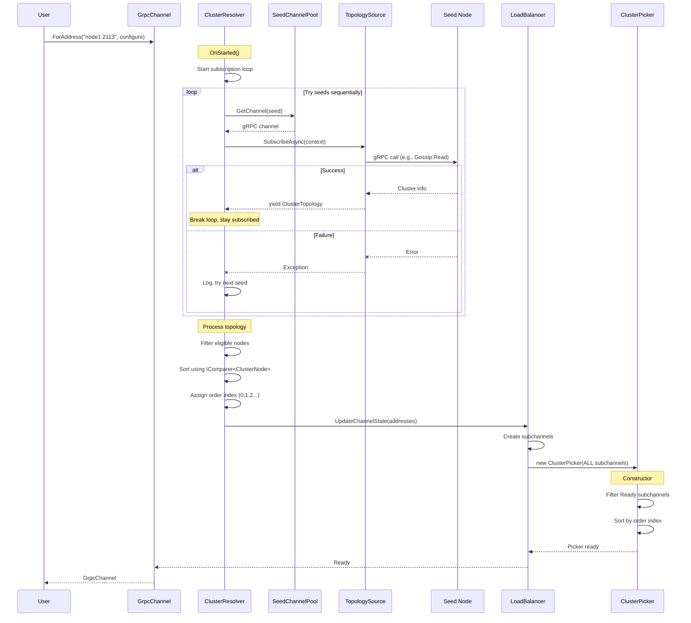
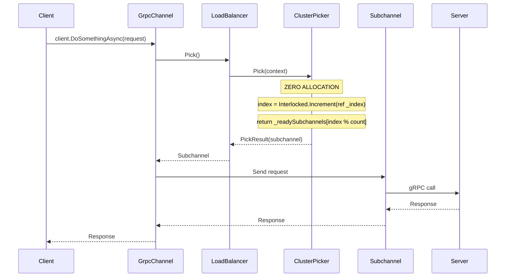
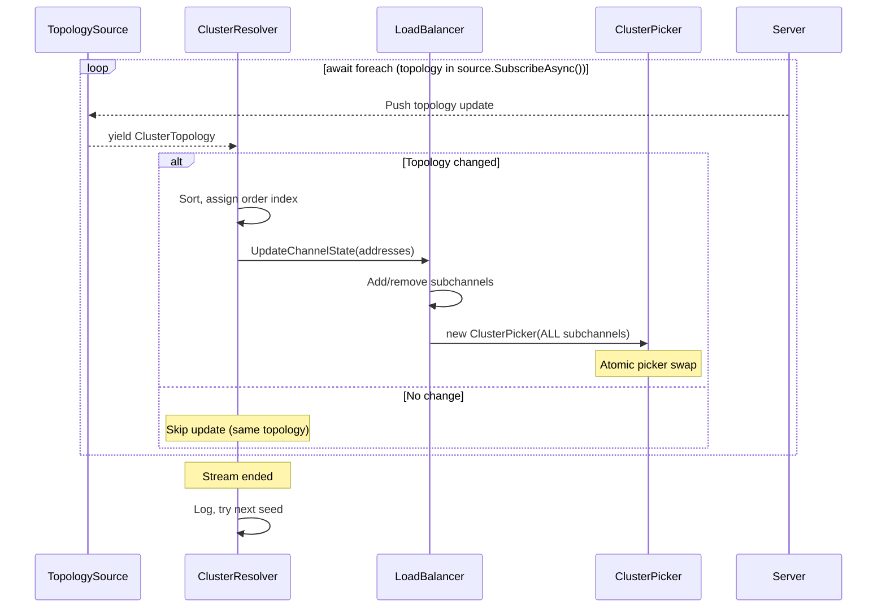
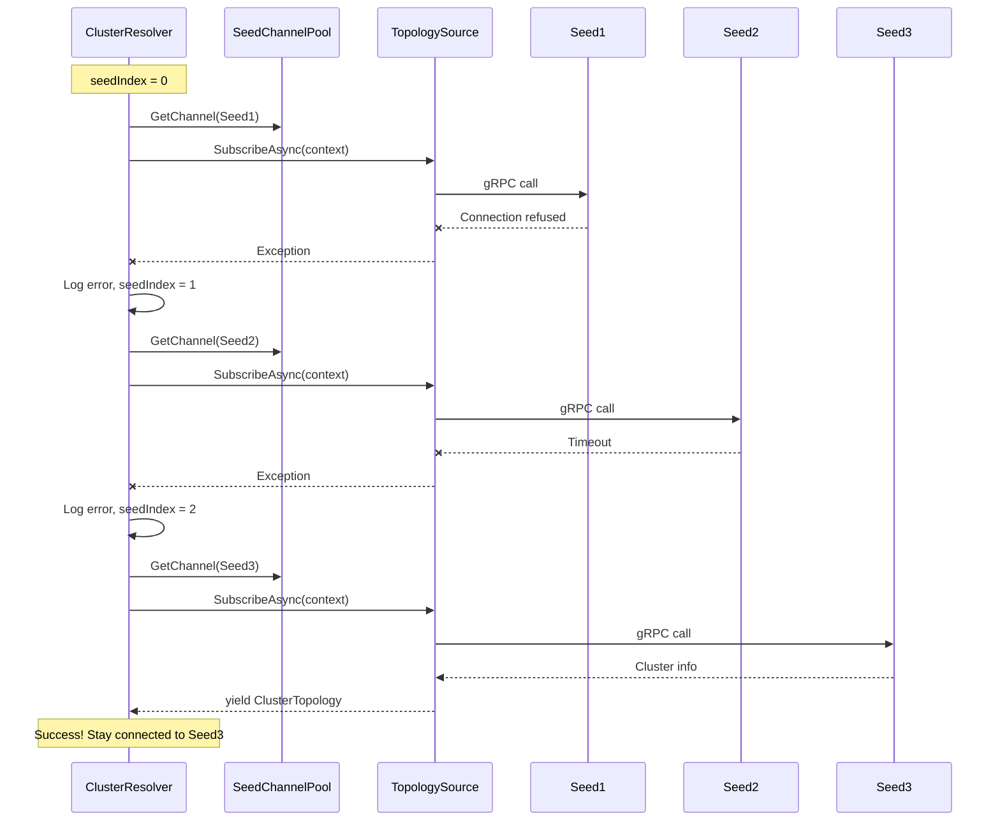
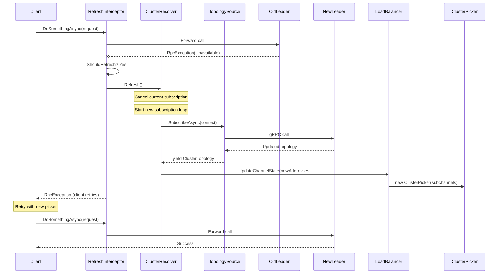

# gRPC Load Balancer Technical Specification

## Raging.Grpc.LoadBalancing

**Version:** 1.0.0
**Status:** Draft
**Last Updated:** 2026-01-09

---

## Table of Contents

1. [Overview](#1-overview)
2. [Goals & Non-Goals](#2-goals--non-goals)
3. [Architecture](#3-architecture)
4. [Component Design & Responsibilities](#4-component-design--responsibilities)
5. [Contracts & Interfaces](#5-contracts--interfaces)
6. [Configuration](#6-configuration)
7. [Sequence Diagrams](#7-sequence-diagrams)
8. [Design Decisions & Rationale](#8-design-decisions--rationale)
9. [Error Handling](#9-error-handling)
10. [Performance Considerations](#10-performance-considerations)
11. [File Structure](#11-file-structure)
12. [Examples](#12-examples)

---

## 1. Overview

A high-performance gRPC load balancer for .NET 8/9/10 that enables cluster-aware client-side load balancing through topology discovery.

### Core Principle

User implements **one interface** (`IPollingTopologySource` or `IStreamingTopologySource`), the library handles everything else:

- Topology discovery from seed nodes
- Node selection based on custom comparer (default: by Priority)
- Subchannel (connection) management
- Automatic refresh on failures
- Integration with gRPC's native load balancing infrastructure

### Key Features

- **Non-Generic API**: Simple `ClusterNode` record struct with `Metadata` dictionary for extensibility
- **Reactive Core**: Internal architecture is streaming-based; polling is adapted to streaming
- **Zero-Allocation Hot Path**: `Pick()` method allocates nothing
- **Flexible Configuration**: POCO options for JSON serialization + fluent builder
- **DI Support**: Full integration with `IServiceCollection`
- **Extensible**: Custom node selection order via `IComparer<ClusterNode>` on topology source
- **Separation of Concerns**: Each component has a single, well-defined responsibility

---

## 2. Goals & Non-Goals

### Goals

| Goal | Description |
|------|-------------|
| **Simplicity** | Single interface implementation, no generics needed |
| **Performance** | Zero allocations on pick hot path |
| **Flexibility** | Support polling and streaming topology sources |
| **Extensibility** | Metadata dictionary for custom node attributes |
| **Integration** | Seamless integration with standard `GrpcChannel` patterns |
| **Resilience** | Automatic retry with seed failover |
| **Observability** | Source-generated logging |
| **Separation of Concerns** | Each component does one thing well |

### Non-Goals (MVP)

| Non-Goal | Reason |
|----------|--------|
| IPv6 bracket notation | Complexity, defer to future |
| DNS SRV discovery | Defer to future |
| Weighted load balancing | Use Priority + custom comparer |
| Health checking | Rely on topology source for health info |

---

## 3. Architecture

### gRPC Load Balancing Concepts

In .NET gRPC, client-side load balancing consists of three components:

| Component | Responsibility |
|-----------|----------------|
| **Resolver** | Discovers server addresses (e.g., via DNS, service discovery) |
| **LoadBalancer** | Manages connections (subchannels) to those addresses |
| **SubchannelPicker** | Picks which connection to use for each RPC call |

```
┌─────────────────────────────────────────────────────────────────┐
│                         GrpcChannel                             │
│                                                                 │
│  ┌─────────────┐    ┌────────────────┐    ┌─────────────────┐  │
│  │   Resolver  │───▶│  LoadBalancer  │───▶│     Picker      │  │
│  │             │    │                │    │                 │  │
│  │ "Here are   │    │ "I manage      │    │ "Use THIS one   │  │
│  │  the        │    │  connections   │    │  for THIS       │  │
│  │  servers"   │    │  to them"      │    │  request"       │  │
│  └─────────────┘    └────────────────┘    └─────────────────┘  │
│                                                                 │
└─────────────────────────────────────────────────────────────────┘
```

### High-Level Architecture

```
┌──────────────────────────────────────────────────────────────────────────────┐
│                              User Code                                        │
│                                                                               │
│  var channel = GrpcLoadBalancedChannel.ForAddress("node1:2113", lb => lb     │
│      .WithSeeds("node2:2113", "node3:2113")                                  │
│      .WithPollingTopologySource(new MyTopologySource()));                    │
│                                                                               │
│  var client = new MyService.MyServiceClient(channel);                        │
│  await client.DoSomethingAsync(request);  // ← Uses load balancing           │
└──────────────────────────────────────────────────────────────────────────────┘
                                    │
                                    ▼
┌──────────────────────────────────────────────────────────────────────────────┐
│                         Library Components                                    │
│                                                                               │
│  ┌────────────────────────────────────────────────────────────────────────┐  │
│  │                    Topology Source (User Implements)                    │  │
│  │                                                                         │  │
│  │  • IPollingTopologySource - request/response discovery                 │  │
│  │  • IStreamingTopologySource - server-push discovery                    │  │
│  │  • IComparer<ClusterNode> - node selection order (THE PICKING ALGO)    │  │
│  └────────────────────────────────────────────────────────────────────────┘  │
│                                    │                                          │
│                                    ▼                                          │
│  ┌────────────────────────────────────────────────────────────────────────┐  │
│  │                         ClusterResolver                                 │  │
│  │                                                                         │  │
│  │  • Subscribes to topology source                                       │  │
│  │  • Iterates through seeds sequentially on failure                      │  │
│  │  • Sorts nodes using topology source's IComparer<ClusterNode>          │  │
│  │  • Assigns order index to preserve comparer's sort order               │  │
│  │  • Passes addresses to LoadBalancer                                    │  │
│  └────────────────────────────────────────────────────────────────────────┘  │
│                                    │                                          │
│                                    ▼                                          │
│  ┌────────────────────────────────────────────────────────────────────────┐  │
│  │                       ClusterLoadBalancer                               │  │
│  │                                                                         │  │
│  │  • Creates/destroys subchannels (TCP connections)                      │  │
│  │  • Monitors subchannel health (Ready, Connecting, Idle, Failure)       │  │
│  │  • Passes ALL subchannels to Picker (no filtering, no sorting)         │  │
│  └────────────────────────────────────────────────────────────────────────┘  │
│                                    │                                          │
│                                    ▼                                          │
│  ┌────────────────────────────────────────────────────────────────────────┐  │
│  │                         ClusterPicker                                   │  │
│  │                                                                         │  │
│  │  • Filters to Ready subchannels only                                   │  │
│  │  • Sorts by order index (preserving topology source comparer order)    │  │
│  │  • Round-robins across sorted Ready subchannels                        │  │
│  │  • ZERO ALLOCATION on Pick() - called on every gRPC call               │  │
│  └────────────────────────────────────────────────────────────────────────┘  │
│                                                                               │
└──────────────────────────────────────────────────────────────────────────────┘
```

---

## 4. Component Design & Responsibilities

### Separation of Concerns

Each component has a single, well-defined responsibility:

| Component | Single Responsibility | Does NOT Do |
|-----------|----------------------|-------------|
| **TopologySource** | Discovers nodes, defines sort order | Connection management, picking |
| **PollingToStreamingAdapter** | Wraps polling source, retry with backoff | Discovery logic, connection management |
| **Resolver** | Converts topology → addresses (sorts using source's comparer) | Connection management |
| **LoadBalancer** | Manages connections (subchannels) | Filtering, sorting, picking |
| **Picker** | Selects connection for each request | Discovery, connection management |

### Component Details

#### 1. ClusterNode

**The single node type used throughout the library.**

```csharp
public readonly record struct ClusterNode {
    public required DnsEndPoint EndPoint { get; init; }
    public bool IsEligible { get; init; } = true;
    public int Priority { get; init; } = 0;
    public ImmutableDictionary<string, object> Metadata { get; init; } = ImmutableDictionary<string, object>.Empty;

    public T? GetMetadata<T>(string key);
    public ClusterNode WithMetadata(string key, object value);
}
```

**Key Points:**
- Concrete record struct, not an interface
- `Metadata` dictionary for custom attributes (datacenter, zone, version, etc.)
- No generics needed - one type fits all use cases
- Helper methods for metadata access

#### 2. IPollingTopologySource / IStreamingTopologySource

**Responsibility:** Discover cluster topology and define node selection order.

```csharp
public interface IStreamingTopologySource : IComparer<ClusterNode> {
    // Discover topology
    IAsyncEnumerable<ClusterTopology> SubscribeAsync(
        TopologyContext context,
        CancellationToken cancellationToken = default);

    // Define selection order (THE PICKING ALGORITHM)
    // Default: sort by Priority ascending
    int IComparer<ClusterNode>.Compare(ClusterNode x, ClusterNode y) =>
        x.Priority.CompareTo(y.Priority);
}
```

**Key Points:**
- User implements this interface
- `SubscribeAsync` yields topology snapshots (streaming) or single snapshot (polling via adapter)
- `IComparer<ClusterNode>` determines node selection order - **this IS the picking algorithm**
- Default comparer sorts by `Priority` ascending (lower = preferred)
- Custom comparers can use `Metadata` for domain-specific sorting (datacenter, latency, etc.)

#### 3. PollingToStreamingAdapter

**Responsibility:** Convert polling source to streaming interface with resilient retry.

```csharp
internal sealed class PollingToStreamingAdapter : IStreamingTopologySource
```

**Key Points:**
- Wraps `IPollingTopologySource`
- Polls at configured interval (`Delay`), yields each result
- On failure: exponential backoff retry (`InitialBackoff` → `MaxBackoff`)
- After `MaxDiscoveryAttempts` consecutive failures: let exception propagate (triggers seed failover)
- Success resets failure counter
- Internal architecture is always streaming-based

#### 4. ClusterResolver

**Responsibility:** Subscribe to topology, convert nodes to addresses with order index.

```csharp
internal sealed class ClusterResolver : Resolver, IAsyncDisposable
```

**Key Points:**
- Iterates through seeds sequentially (round-robin on failure)
- Stays connected to streaming source "forever" until it ends
- On topology update:
  1. Filters to eligible nodes
  2. Sorts using topology source (IComparer<ClusterNode>)
  3. Assigns sequential order index (0, 1, 2...)
  4. Passes `BalancerAddress` list to LoadBalancer
- **Does NOT manage connections**

#### 5. ClusterLoadBalancer

**Responsibility:** Manage subchannels (connections) to addresses.

```csharp
internal sealed class ClusterLoadBalancer : LoadBalancer
```

**Key Points:**
- Creates/destroys `Subchannel` objects for each address
- Monitors subchannel state changes
- On state change: creates new `ClusterPicker` with **ALL** subchannels
- **Does NOT filter or sort** - passes everything to Picker
- **Does NOT pick** - that's the Picker's job

#### 6. ClusterPicker

**Responsibility:** Select which subchannel to use for each gRPC call.

```csharp
internal sealed class ClusterPicker : SubchannelPicker
```

**Key Points:**
- Called on **every single gRPC call** (hot path)
- At construction:
  1. Filters to Ready subchannels only
  2. Sorts by order index (preserves topology source comparer order)
- At `Pick()`:
  1. Atomic increment of round-robin index
  2. Return `_readySubchannels[index % count]`
  3. **ZERO ALLOCATIONS**

#### 7. SeedChannelPool

**Responsibility:** Manage reusable gRPC channels to seed nodes.

```csharp
internal sealed class SeedChannelPool : IAsyncDisposable
```

**Key Points:**
- Creates channels lazily
- Reuses channels across discovery attempts
- Disposes all channels on shutdown

#### 8. ClusterTopology

**Responsibility:** Immutable snapshot of cluster nodes with cached computations.

```csharp
public readonly record struct ClusterTopology(ImmutableArray<ClusterNode> Nodes)
```

**Key Points:**
- Uses `ImmutableArray<ClusterNode>` for value semantics
- Caches hash code and eligible count at construction
- Value equality based on node content (not reference)
- `ComputeDiff()` method for change detection

---

## 5. Contracts & Interfaces

### ClusterNode

```csharp
/// <summary>
/// Represents a node in the cluster.
/// </summary>
public readonly record struct ClusterNode {
    /// <summary>
    /// The endpoint to connect to.
    /// </summary>
    public required DnsEndPoint EndPoint { get; init; }

    /// <summary>
    /// Whether this node can accept connections.
    /// Nodes with IsEligible=false are excluded from load balancing.
    /// </summary>
    public bool IsEligible { get; init; } = true;

    /// <summary>
    /// Selection priority. Lower values are preferred.
    /// Nodes with equal priority are load-balanced via round-robin.
    /// </summary>
    public int Priority { get; init; } = 0;

    /// <summary>
    /// Custom metadata for domain-specific node information.
    /// Use this for datacenter, zone, version, or any other custom attributes.
    /// </summary>
    public ImmutableDictionary<string, object> Metadata { get; init; }
        = ImmutableDictionary<string, object>.Empty;

    /// <summary>
    /// Gets a metadata value by key, or default if not found.
    /// </summary>
    public T? GetMetadata<T>(string key) =>
        Metadata.TryGetValue(key, out var value) && value is T typed ? typed : default;

    /// <summary>
    /// Creates a new node with additional metadata.
    /// </summary>
    public ClusterNode WithMetadata(string key, object value) =>
        this with { Metadata = Metadata.SetItem(key, value) };
}
```

### ClusterTopology

```csharp
/// <summary>
/// Immutable snapshot of cluster topology with cached computations.
/// </summary>
public readonly record struct ClusterTopology(ImmutableArray<ClusterNode> Nodes) {
    public static ClusterTopology Empty => new(ImmutableArray<ClusterNode>.Empty);
    public bool IsEmpty => Nodes.IsDefaultOrEmpty;
    public int Count => Nodes.IsDefaultOrEmpty ? 0 : Nodes.Length;
    public int EligibleCount { get; }  // Cached at construction

    // Value equality based on node content
    public bool Equals(ClusterTopology other);
    public override int GetHashCode();  // Cached at construction

    // Change detection
    public (int Added, int Removed) ComputeDiff(ClusterTopology other);
}
```

### TopologyContext

```csharp
/// <summary>
/// Context provided to topology source operations.
/// </summary>
public sealed record TopologyContext {
    /// <summary>
    /// Channel connected to a cluster seed node.
    /// </summary>
    public required ChannelBase Channel { get; init; }

    /// <summary>
    /// Cancellation token for the operation.
    /// </summary>
    public required CancellationToken CancellationToken { get; init; }

    /// <summary>
    /// Timeout for this topology call.
    /// </summary>
    public required TimeSpan Timeout { get; init; }

    /// <summary>
    /// The endpoint this channel is connected to.
    /// </summary>
    public required DnsEndPoint Endpoint { get; init; }
}
```

### IPollingTopologySource

```csharp
/// <summary>
/// Polling topology source. Implement for request/response discovery protocols.
/// The library polls at the configured delay interval.
/// </summary>
public interface IPollingTopologySource : IComparer<ClusterNode> {
    /// <summary>
    /// Fetch current cluster topology.
    /// </summary>
    ValueTask<ClusterTopology> GetClusterAsync(TopologyContext context);

    /// <summary>
    /// Node comparison for selection order. THE PICKING ALGORITHM.
    /// Default: sort by Priority ascending (lower = preferred).
    /// Override to customize (e.g., prefer same datacenter, least latency).
    /// </summary>
    int IComparer<ClusterNode>.Compare(ClusterNode x, ClusterNode y) =>
        x.Priority.CompareTo(y.Priority);
}
```

### IStreamingTopologySource

```csharp
/// <summary>
/// Streaming topology source. Implement if server pushes topology changes.
/// </summary>
public interface IStreamingTopologySource : IComparer<ClusterNode> {
    /// <summary>
    /// Subscribe to cluster topology changes.
    /// Each yielded value is the complete current topology (snapshot model).
    /// The enumerable should yield continuously until cancelled.
    /// </summary>
    IAsyncEnumerable<ClusterTopology> SubscribeAsync(
        TopologyContext context,
        CancellationToken cancellationToken = default);

    /// <summary>
    /// Node comparison for selection order. THE PICKING ALGORITHM.
    /// Default: sort by Priority ascending (lower = preferred).
    /// Override to customize (e.g., prefer same datacenter, least latency).
    /// </summary>
    int IComparer<ClusterNode>.Compare(ClusterNode x, ClusterNode y) =>
        x.Priority.CompareTo(y.Priority);
}
```

---

## 6. Configuration

### LoadBalancingOptions (POCO)

```csharp
public sealed class LoadBalancingOptions {
    /// <summary>
    /// Seed endpoints for discovery. Format: "host:port"
    /// </summary>
    public required string[] Seeds { get; set; }

    /// <summary>
    /// Delay between topology polls (only for polling source).
    /// </summary>
    public TimeSpan Delay { get; set; } = TimeSpan.FromSeconds(30);

    /// <summary>
    /// Resilience configuration.
    /// </summary>
    public ResilienceOptions Resilience { get; set; } = new();
}

public sealed class ResilienceOptions {
    /// <summary>
    /// Timeout for individual topology calls.
    /// </summary>
    public TimeSpan Timeout { get; set; } = TimeSpan.FromSeconds(5);

    /// <summary>
    /// Maximum consecutive failures before giving up on a seed.
    /// After this many failures, the adapter lets the exception propagate
    /// so the resolver can try the next seed.
    /// </summary>
    public int MaxDiscoveryAttempts { get; set; } = 10;

    /// <summary>
    /// Initial backoff duration after a polling failure.
    /// </summary>
    public TimeSpan InitialBackoff { get; set; } = TimeSpan.FromMilliseconds(100);

    /// <summary>
    /// Maximum backoff duration (cap for exponential growth).
    /// </summary>
    public TimeSpan MaxBackoff { get; set; } = TimeSpan.FromSeconds(5);

    /// <summary>
    /// gRPC status codes that trigger topology refresh.
    /// </summary>
    public int[] RefreshOnStatusCodes { get; set; } = [14]; // Unavailable
}
```

### JSON Configuration

```json
{
  "LoadBalancing": {
    "Seeds": ["node1:2113", "node2:2113", "node3:2113"],
    "Delay": "00:00:30",
    "Resilience": {
      "Timeout": "00:00:05",
      "MaxDiscoveryAttempts": 10,
      "InitialBackoff": "00:00:00.100",
      "MaxBackoff": "00:00:05",
      "RefreshOnStatusCodes": [14]
    }
  }
}
```

### Fluent Builder (Non-DI)

```csharp
var channel = GrpcLoadBalancedChannel.ForAddress("node1:5000", lb => lb
    .WithSeeds("node2:5000", "node3:5000")
    .WithPollingTopologySource(new MyTopologySource(), delay: TimeSpan.FromSeconds(30))
    .WithResilience(r => r.Timeout = TimeSpan.FromSeconds(3))
    .WithLoggerFactory(loggerFactory)
    .ConfigureChannel(opts => opts.MaxReceiveMessageSize = 16 * 1024 * 1024));
```

### DI Registration

```csharp
services.AddGrpcLoadBalancing("node1:5000")
    .WithSeeds("node2:5000", "node3:5000")
    .WithPollingTopologySource<MyTopologySource>(delay: TimeSpan.FromSeconds(30))
    .Build();

// Inject
public class MyService(GrpcChannel channel) {
    readonly MyGrpcClient _client = new(channel);
}
```

---

## 7. Sequence Diagrams

### Startup & Initial Discovery



### Per-Call Pick (Hot Path)



### Continuous Streaming Updates



### Seed Failover



### Reactive Refresh on Failure



---

## 8. Design Decisions & Rationale

### Decision 1: Non-Generic API with Metadata Dictionary

**Choice:** Use concrete `ClusterNode` record struct with `Metadata` dictionary instead of generic `TNode`.

**Rationale:**
- **Simplicity**: Users don't need to define their own node type
- **No Generics**: Eliminates type parameter complexity throughout the codebase
- **Extensibility**: `Metadata` dictionary allows arbitrary custom attributes
- **Performance**: Hot path (`Pick()`) doesn't access metadata - only cold path (comparer)

**Implementation:**
```csharp
// User stores custom data in Metadata
var node = new ClusterNode {
    EndPoint = new DnsEndPoint("host", 5000),
    Priority = 1,
    Metadata = ImmutableDictionary<string, object>.Empty
        .Add("datacenter", "us-east-1")
        .Add("version", "2.0.0")
};

// Custom comparer accesses metadata
public int Compare(ClusterNode x, ClusterNode y) {
    var xDc = x.GetMetadata<string>("datacenter") ?? "";
    var yDc = y.GetMetadata<string>("datacenter") ?? "";
    // Prefer same datacenter
    var xLocal = xDc == _myDc ? 0 : 1;
    var yLocal = yDc == _myDc ? 0 : 1;
    if (xLocal != yLocal) return xLocal.CompareTo(yLocal);
    return x.Priority.CompareTo(y.Priority);
}
```

### Decision 2: Separation of Concerns

**Choice:** Each component (Resolver, LoadBalancer, Picker) has a single responsibility.

**Rationale:**
- **Testability**: Each component can be tested in isolation
- **Maintainability**: Changes to one concern don't affect others
- **Clarity**: Easy to understand what each component does

**Implementation:**
| Component | Does | Does NOT |
|-----------|------|----------|
| Resolver | Discovers addresses | Manage connections, pick |
| LoadBalancer | Manages connections | Filter, sort, pick |
| Picker | Picks connection per request | Discover, manage connections |

### Decision 3: Comparer on Topology Source

**Choice:** The `IComparer<ClusterNode>` is defined on the topology source interface.

**Rationale:**
- The topology source knows the domain (node types, priorities, datacenters)
- Custom sorting logic can use domain-specific fields in `Metadata`
- Single place to define "which nodes are preferred"

**Implementation:**
```csharp
// Default: sort by Priority
int IComparer<ClusterNode>.Compare(ClusterNode x, ClusterNode y) =>
    x.Priority.CompareTo(y.Priority);

// Custom: prefer same datacenter
public int Compare(ClusterNode x, ClusterNode y) {
    var xLocal = x.GetMetadata<string>("datacenter") == _myDc ? 0 : 1;
    var yLocal = y.GetMetadata<string>("datacenter") == _myDc ? 0 : 1;
    return xLocal != yLocal
        ? xLocal.CompareTo(yLocal)
        : x.Priority.CompareTo(y.Priority);
}
```

### Decision 4: Order Index Instead of Direct Comparer in Picker

**Choice:** Resolver sorts and assigns order index; Picker sorts by index.

**Rationale:**
- Picker only has `Subchannel` objects, not `ClusterNode` objects
- Order index preserves comparer's sort order across the boundary
- Simple integer comparison in Picker (fast)

**Implementation:**
```csharp
// In Resolver
eligible.Sort(_topologySource);  // Uses IComparer<ClusterNode>
for (var i = 0; i < eligible.Count; i++) {
    attributes.Add(OrderIndexKey, i);  // Preserve order
}

// In Picker
ready.Sort((a, b) => GetOrderIndex(a).CompareTo(GetOrderIndex(b)));
```

### Decision 5: LoadBalancer Passes ALL Subchannels

**Choice:** LoadBalancer passes all subchannels to Picker, not just Ready ones.

**Rationale:**
- **Separation of concerns**: LoadBalancer manages connections, Picker decides what's usable
- **Flexibility**: Picker could implement more sophisticated logic (e.g., prefer Connecting over none)
- **Immutability**: New Picker is created on state change; it sees snapshot of all subchannels

### Decision 6: Sequential Seed Iteration (Not Parallel)

**Choice:** On failure, try seeds one at a time in round-robin order.

**Rationale:**
- **Simplicity**: Easy to understand and debug
- **Efficiency**: No need to cancel parallel tasks
- **Streaming model**: Stay connected to one seed's stream; only switch on failure

### Decision 7: ClusterTopology as Value Object

**Choice:** `ClusterTopology` is a record struct with value equality.

**Rationale:**
- **Comparison**: Can check `if (oldTopology != newTopology)` efficiently
- **Caching**: Hash code and eligible count computed once at construction
- **Immutability**: Safe to pass around, no defensive copies needed

**Implementation:**
```csharp
public readonly record struct ClusterTopology(ImmutableArray<ClusterNode> Nodes) {
    readonly int _cachedHashCode;
    readonly int _eligibleCount;

    public ClusterTopology(ImmutableArray<ClusterNode> nodes) : this() {
        Nodes = nodes;
        _cachedHashCode = ComputeHashCode(nodes);
        _eligibleCount = CountEligible(nodes);
    }
}
```

### Decision 8: Streaming-First Internal Architecture

**Choice:** Everything internally is streaming-based; polling is adapted.

**Rationale:**
- **Reactive**: Immediately process topology updates as they arrive
- **Unified**: One code path for both polling and streaming sources
- **Natural**: `await foreach` fits perfectly

**Implementation:**
```csharp
// Resolver just iterates
await foreach (var topology in _topologySource.SubscribeAsync(context, ct)) {
    // Process topology update
}

// Polling adapter yields periodically
while (!ct.IsCancellationRequested) {
    yield return await _pollingSource.GetClusterAsync(context);
    await Task.Delay(_delay, ct);
}
```

### Decision 9: Backoff in PollingToStreamingAdapter (Not Resolver)

**Choice:** Exponential backoff retry is handled in `PollingToStreamingAdapter`, not in `ClusterResolver`.

**Rationale:**
- **Layered resilience**: Adapter handles transient failures within ONE seed; Resolver handles seed failover
- **Separation of concerns**: Adapter knows about polling errors; Resolver knows about seed switching
- **Configurable per-seed**: `MaxDiscoveryAttempts` failures before giving up on a seed

**Implementation:**
```csharp
// In PollingToStreamingAdapter
while (!ct.IsCancellationRequested) {
    try {
        topology = await _pollingSource.GetClusterAsync(context);
        consecutiveFailures = 0;  // Reset on success
    }
    catch (Exception ex) {
        consecutiveFailures++;

        if (consecutiveFailures >= _resilience.MaxDiscoveryAttempts)
            throw;  // Let resolver try next seed

        var backoff = BackoffCalculator.Calculate(
            consecutiveFailures,
            _resilience.InitialBackoff,
            _resilience.MaxBackoff);

        await Task.Delay(backoff, ct);
        continue;
    }
    yield return topology;
    await Task.Delay(_delay, ct);
}
```

**Backoff formula:** `min(InitialBackoff * 2^(attempt-1), MaxBackoff) ± 10% jitter`

---

## 9. Error Handling

### Exception Hierarchy

```csharp
public abstract class LoadBalancingException : Exception;

public sealed class LoadBalancingConfigurationException : LoadBalancingException;
public sealed class ClusterDiscoveryException : LoadBalancingException;
public sealed class NoEligibleNodesException : LoadBalancingException;
public sealed class TopologyException : LoadBalancingException;
```

### Failure Scenarios

| Scenario | Behavior |
|----------|----------|
| Polling fails (transient) | Exponential backoff retry (InitialBackoff → MaxBackoff) |
| Polling fails (MaxDiscoveryAttempts reached) | Let exception propagate, try next seed |
| Seed connection fails | Log, try next seed |
| Stream ends without data | Log `TopologyStreamEmpty`, try next seed |
| All seeds fail continuously | Keep trying (round-robin through seeds forever) |
| Topology returns no eligible nodes | Throw `NoEligibleNodesException` |
| Topology returns empty | Throw `ClusterDiscoveryException` |
| gRPC call fails with Unavailable | Trigger refresh via interceptor |

### Refresh Policy

```csharp
public delegate bool ShouldRefreshTopology(RpcException exception);

public static class RefreshPolicy {
    // Default: refresh on Unavailable status
    public static readonly ShouldRefreshTopology Default =
        static ex => ex.StatusCode == StatusCode.Unavailable;

    // Refresh on specific status codes
    public static ShouldRefreshTopology OnStatusCodes(params StatusCode[] codes);

    // Refresh on status codes as integers (for configuration)
    public static ShouldRefreshTopology FromStatusCodeInts(params int[] statusCodes);

    // Refresh when exception message contains specified strings
    public static ShouldRefreshTopology OnMessageContains(params string[] triggers);

    // Combine policies (refresh if ANY match)
    public static ShouldRefreshTopology Any(params ShouldRefreshTopology[] policies);

    // Combine policies (refresh if ALL match)
    public static ShouldRefreshTopology All(params ShouldRefreshTopology[] policies);
}
```

---

## 10. Performance Considerations

### Allocation Budgets

| Path | Allocation Budget | Frequency |
|------|-------------------|-----------|
| `Pick()` | **0 bytes** | Every gRPC call (millions/sec) |
| Topology update | < 4 KB | Every few seconds |
| Picker creation | < 1 KB | On topology change |
| Startup | Unbounded | Once |

### Hot Path: Pick()

```csharp
public override PickResult Pick(PickContext context) {
    // ZERO ALLOCATION - called on every gRPC call

    if (_readySubchannels.Length == 0)
        return PickResult.ForFailure(NoReadyNodesStatus);  // Static instance

    var index = Interlocked.Increment(ref _roundRobinIndex);
    var count = _readySubchannels.Length;
    var selectedIndex = ((index % count) + count) % count;

    return PickResult.ForSubchannel(_readySubchannels[selectedIndex]);
}
```

### Cold Path: Picker Construction

```csharp
public ClusterPicker(IReadOnlyList<Subchannel> subchannels) {
    // COLD PATH - only on topology change

    var ready = new List<Subchannel>();  // Allocation OK here
    foreach (var s in subchannels)
        if (s.State == ConnectivityState.Ready)
            ready.Add(s);

    ready.Sort((a, b) => GetOrderIndex(a).CompareTo(GetOrderIndex(b)));
    _readySubchannels = [.. ready];
}
```

### Metadata Performance

The `Metadata` dictionary is only accessed in:
- Topology source constructor (startup, cold)
- Custom comparer (topology update, cold)

**Never accessed on hot path** - so dictionary lookup overhead doesn't affect performance.

### ConfigureAwait(false)

All async methods use `ConfigureAwait(false)`:

```csharp
await _topologySource.SubscribeAsync(context, ct).ConfigureAwait(false);
await Task.Delay(delay, ct).ConfigureAwait(false);
```

---

## 11. File Structure

```
src/Raging.Grpc.LoadBalancing/
│
├── Raging.Grpc.LoadBalancing.csproj
├── GrpcLoadBalancedChannel.cs              # Static entry point
├── LoadBalancingBuilder.cs                 # Non-DI builder
│
├── Abstractions/
│   ├── ClusterNode.cs                      # Concrete node type with Metadata
│   ├── ClusterTopology.cs                  # Topology value object
│   ├── IPollingTopologySource.cs           # Polling source interface
│   ├── IStreamingTopologySource.cs         # Streaming source interface
│   └── TopologyContext.cs                  # Context record
│
├── Configuration/
│   ├── LoadBalancingOptions.cs             # POCO options
│   ├── ResilienceOptions.cs                # Resilience config
│   ├── ShouldRefreshTopology.cs            # Delegate
│   └── RefreshPolicy.cs                    # Built-in policies
│
├── Exceptions/
│   ├── LoadBalancingException.cs           # Base exception
│   ├── LoadBalancingConfigurationException.cs
│   ├── ClusterDiscoveryException.cs
│   ├── NoEligibleNodesException.cs
│   └── TopologyException.cs
│
├── Internal/
│   ├── ClusterResolver.cs                  # Topology → addresses
│   ├── ClusterResolverFactory.cs
│   ├── ClusterLoadBalancer.cs              # Manages subchannels
│   ├── ClusterLoadBalancerFactory.cs
│   ├── ClusterPicker.cs                    # Picks per request
│   ├── PollingToStreamingAdapter.cs        # Wraps polling source
│   ├── RefreshTriggerInterceptor.cs        # Triggers refresh on error
│   ├── SeedChannelPool.cs                  # Reusable seed channels
│   ├── BackoffCalculator.cs                # Exponential backoff
│   └── Log.cs                              # Source-generated logging
│
├── Utilities/
│   └── EndpointParser.cs                   # "host:port" parsing
│
└── Extensions/
    ├── ServiceCollectionExtensions.cs      # DI registration
    └── LoadBalancingServiceBuilder.cs      # DI builder
```

---

## 12. Examples

### Example 1: Simple Polling Source

```csharp
// Implement topology source (uses default comparer - by Priority)
public sealed class MyTopologySource : IPollingTopologySource {
    public async ValueTask<ClusterTopology> GetClusterAsync(TopologyContext context) {
        var client = new ClusterService.ClusterServiceClient(context.Channel);

        var response = await client.GetNodesAsync(
            new GetNodesRequest(),
            cancellationToken: context.CancellationToken);

        var nodes = response.Nodes
            .Select(n => new ClusterNode {
                EndPoint = new DnsEndPoint(n.Host, n.Port),
                IsEligible = n.Status == NodeStatus.Ready,
                Priority = n.IsLeader ? 0 : 1
            })
            .ToImmutableArray();

        return new ClusterTopology(nodes);
    }
}

// Use it
var channel = GrpcLoadBalancedChannel.ForAddress("node1:5000", lb => lb
    .WithSeeds("node2:5000", "node3:5000")
    .WithPollingTopologySource(new MyTopologySource(), delay: TimeSpan.FromSeconds(30)));

var client = new MyService.MyServiceClient(channel);
await client.DoSomethingAsync(request);
```

### Example 2: Custom Comparer (Datacenter Affinity)

```csharp
public sealed class DatacenterAwareSource : IPollingTopologySource {
    readonly string _preferredDc;

    public DatacenterAwareSource(string preferredDc) => _preferredDc = preferredDc;

    public async ValueTask<ClusterTopology> GetClusterAsync(TopologyContext context) {
        var client = new ClusterService.ClusterServiceClient(context.Channel);
        var response = await client.GetNodesAsync(new GetNodesRequest(),
            cancellationToken: context.CancellationToken);

        var nodes = response.Nodes
            .Select(n => new ClusterNode {
                EndPoint = new DnsEndPoint(n.Host, n.Port),
                IsEligible = n.Status == NodeStatus.Ready,
                Priority = n.IsLeader ? 0 : 1,
                Metadata = ImmutableDictionary<string, object>.Empty
                    .Add("datacenter", n.Datacenter)
            })
            .ToImmutableArray();

        return new ClusterTopology(nodes);
    }

    // Custom comparer: prefer same datacenter, then by priority
    public int Compare(ClusterNode x, ClusterNode y) {
        var xDc = x.GetMetadata<string>("datacenter") ?? "";
        var yDc = y.GetMetadata<string>("datacenter") ?? "";

        var xLocal = xDc == _preferredDc ? 0 : 1;
        var yLocal = yDc == _preferredDc ? 0 : 1;

        if (xLocal != yLocal)
            return xLocal.CompareTo(yLocal);

        return x.Priority.CompareTo(y.Priority);
    }
}

// Use it - nodes in same DC are preferred
var channel = GrpcLoadBalancedChannel.ForAddress("node1:5000", lb => lb
    .WithSeeds("node2:5000", "node3:5000")
    .WithPollingTopologySource(new DatacenterAwareSource("us-east-1")));
```

### Example 3: Streaming Source (Server Push)

```csharp
public sealed class StreamingTopologySource : IStreamingTopologySource {
    public async IAsyncEnumerable<ClusterTopology> SubscribeAsync(
        TopologyContext context,
        [EnumeratorCancellation] CancellationToken cancellationToken = default) {

        var client = new ClusterService.ClusterServiceClient(context.Channel);

        using var stream = client.WatchCluster(
            new WatchRequest(),
            cancellationToken: cancellationToken);

        await foreach (var update in stream.ResponseStream.ReadAllAsync(cancellationToken)) {
            var nodes = update.Nodes
                .Select(n => new ClusterNode {
                    EndPoint = new DnsEndPoint(n.Host, n.Port),
                    IsEligible = n.Status == NodeStatus.Ready,
                    Priority = n.IsLeader ? 0 : 1
                })
                .ToImmutableArray();

            yield return new ClusterTopology(nodes);
        }
    }
}

// Use it - topology updates are pushed by server
var channel = GrpcLoadBalancedChannel.ForAddress("node1:5000", lb => lb
    .WithSeeds("node2:5000", "node3:5000")
    .WithStreamingTopologySource(new StreamingTopologySource()));
```

### Example 4: DI Registration with Factory

```csharp
// Register with factory for DI
services.AddGrpcLoadBalancing("node1:5000")
    .WithSeeds("node2:5000", "node3:5000")
    .WithPollingTopologySource(sp => {
        var config = sp.GetRequiredService<IOptions<MyConfig>>().Value;
        var logger = sp.GetRequiredService<ILogger<MyTopologySource>>();
        return new DatacenterAwareSource(config.PreferredDatacenter);
    })
    .ConfigureChannel(opts => {
        opts.Credentials = ChannelCredentials.SecureSsl;
    })
    .Build();

// Inject and use
public class MyService {
    readonly MyGrpcClient _client;

    public MyService(GrpcChannel channel) {
        _client = new MyGrpcClient(channel);
    }

    public Task DoWorkAsync() => _client.DoSomethingAsync(new Request());
}
```

### Example 5: Custom Refresh Policy

```csharp
var channel = GrpcLoadBalancedChannel.ForAddress("node1:5000", lb => lb
    .WithSeeds("node2:5000", "node3:5000")
    .WithPollingTopologySource(new MyTopologySource())
    .WithRefreshPolicy(RefreshPolicy.Any(
        RefreshPolicy.Default,  // Unavailable
        RefreshPolicy.OnStatusCodes(StatusCode.NotFound, StatusCode.Internal),
        ex => ex.Message.Contains("leader changed", StringComparison.OrdinalIgnoreCase)
    )));
```

---

## Summary

This load balancer provides:

- **Simple API**: Implement one interface, no generics needed
- **Clear Separation**: Resolver discovers, LoadBalancer connects, Picker selects
- **High Performance**: Zero allocations on hot path
- **Flexible Extension**: Metadata dictionary for custom node attributes
- **Flexible Selection**: Custom comparer for any selection logic
- **Resilient**: Automatic seed failover, refresh on errors
- **Observable**: Source-generated structured logging

The implementation follows gRPC's native load balancing patterns while providing a much simpler developer experience.
