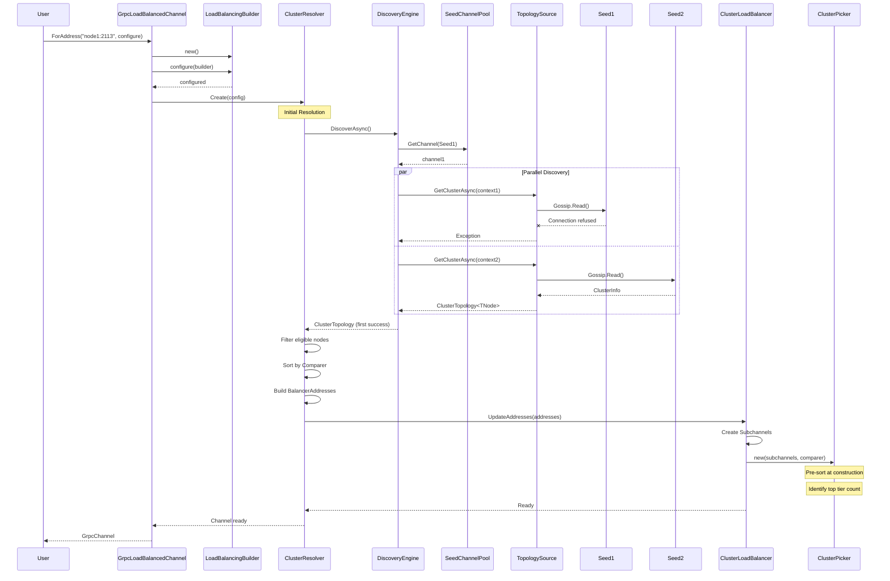
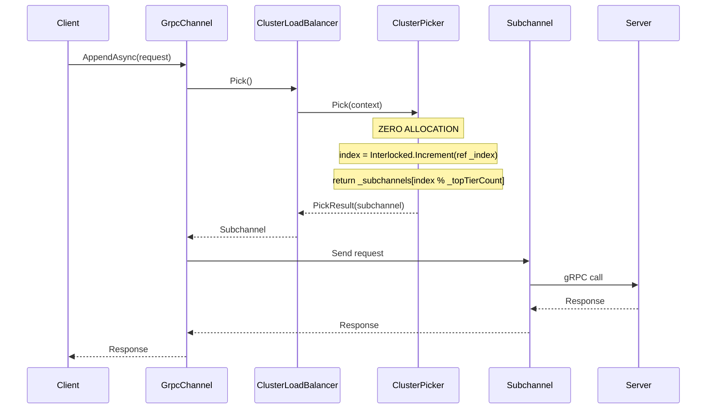
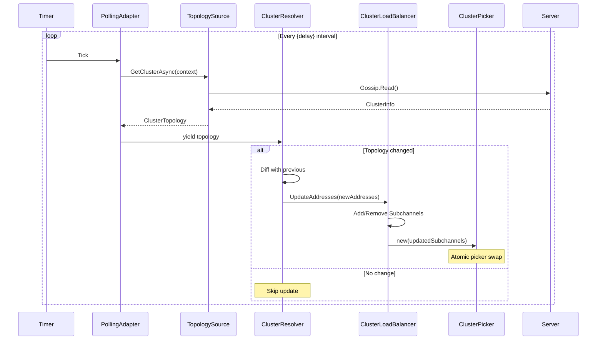
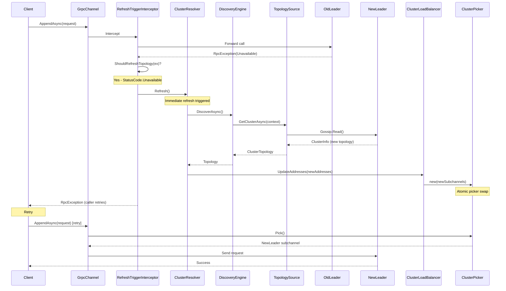
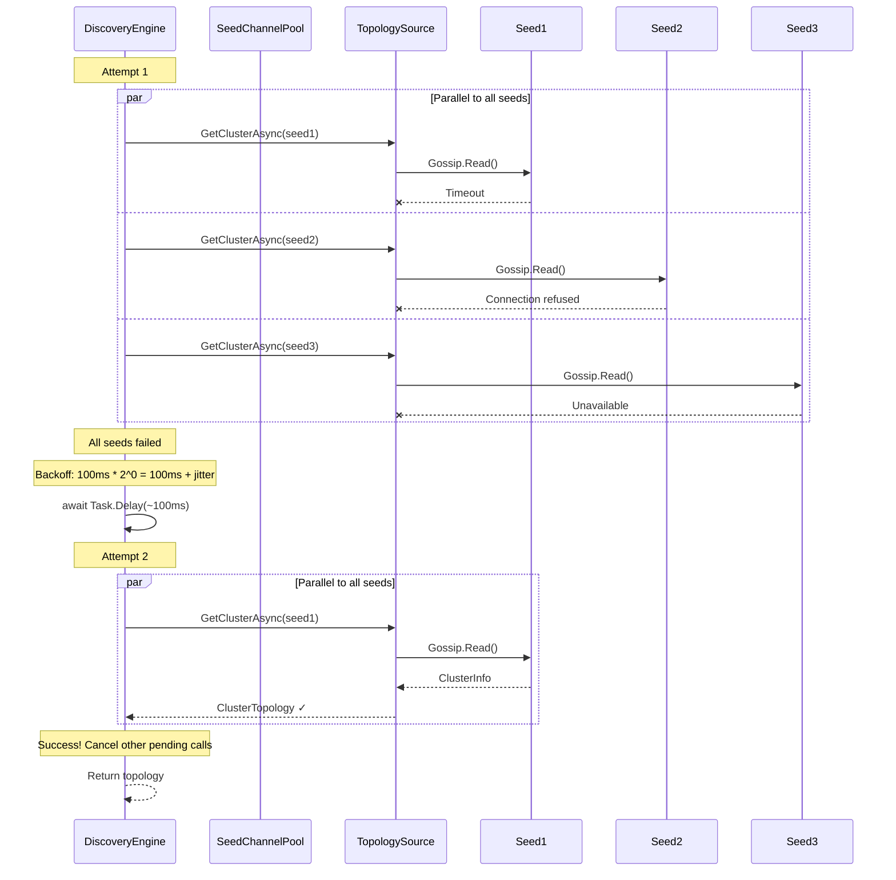

# gRPC Load Balancer Technical Specification

## Raging.Grpc.LoadBalancing

**Version:** 1.0.0-alpha
**Status:** Draft
**Last Updated:** 2026-01-08

---

## Table of Contents

1. [Overview](#1-overview)
2. [Goals & Non-Goals](#2-goals--non-goals)
3. [Public API](#3-public-api)
4. [Contracts & Interfaces](#4-contracts--interfaces)
5. [Configuration](#5-configuration)
6. [Builders](#6-builders)
7. [Internal Architecture](#7-internal-architecture)
8. [Sequence Diagrams](#8-sequence-diagrams)
9. [Error Handling](#9-error-handling)
10. [File Structure](#10-file-structure)
11. [Edge Cases & Behaviors](#11-edge-cases--behaviors)
12. [Performance Considerations](#12-performance-considerations)
13. [Implementation Notes](#13-implementation-notes)

---

## 1. Overview

A generic, high-performance gRPC load balancer for .NET 8/9/10 that enables cluster-aware client-side load balancing through topology discovery.

### Core Principle

User implements **one interface** (`IPollingTopologySource<TNode>` or `IStreamingTopologySource<TNode>`), the library handles everything else:
- Topology discovery with retry and backoff
- Node selection based on priority
- Subchannel management
- Automatic refresh on failures
- Integration with gRPC's native load balancing infrastructure

### Key Features

- **Reactive Core**: Internal architecture is streaming-based; polling is adapted to streaming
- **Zero-Allocation Hot Path**: `Pick()` method allocates nothing
- **Flexible Configuration**: POCO options for JSON serialization + fluent builder
- **DI Support**: Full integration with `IServiceCollection`
- **Extensible**: Custom comparison logic via interface implementation

---

## 2. Goals & Non-Goals

### Goals

| Goal | Description |
|------|-------------|
| **Simplicity** | Single interface implementation for users |
| **Performance** | Zero allocations on pick hot path |
| **Flexibility** | Support polling and streaming topology sources |
| **Integration** | Seamless integration with standard `GrpcChannel` patterns |
| **Resilience** | Automatic retry, backoff, and failure handling |
| **Observability** | Source-generated logging |

### Non-Goals (MVP)

| Non-Goal | Reason |
|----------|--------|
| IPv6 bracket notation | Complexity, defer to future |
| DNS SRV discovery | Defer to future |
| Per-call node preference | Simplicity; user controls via Priority |
| Weighted load balancing | Priority tiers + round-robin sufficient |
| Health checking | Rely on topology source for health info |

---

## 3. Public API

### Entry Points

```csharp
namespace Raging.Grpc.LoadBalancing;

public static class GrpcLoadBalancedChannel {

    /// <summary>
    /// Create a load-balanced channel for the specified address.
    /// </summary>
    public static GrpcChannel ForAddress(
        string address,
        Action<LoadBalancingBuilder> configure);

    /// <summary>
    /// Create a load-balanced channel from configuration.
    /// </summary>
    public static GrpcChannel FromConfiguration(
        IConfiguration configuration,
        Action<LoadBalancingBuilder> configure);
}
```

### Usage Examples

#### Non-DI: Simple

```csharp
using var channel = GrpcLoadBalancedChannel.ForAddress("node1:2113", lb => lb
    .WithSeeds("node2:2113", "node3:2113")
    .WithPollingTopologySource(new KurrentTopologySource(), delay: TimeSpan.FromSeconds(30))
);

var client = new Streams.StreamsClient(channel);
await client.AppendAsync(request);
```

#### Non-DI: Full Configuration

```csharp
using var channel = GrpcLoadBalancedChannel.ForAddress("node1:2113", lb => lb
    .WithSeeds("node2:2113", "node3:2113")
    .WithResilience(r => {
        r.Timeout = TimeSpan.FromSeconds(3);
        r.MaxDiscoveryAttempts = 5;
        r.InitialBackoff = TimeSpan.FromMilliseconds(50);
        r.MaxBackoff = TimeSpan.FromSeconds(2);
    })
    .WithPollingTopologySource(new KurrentTopologySource(), delay: TimeSpan.FromSeconds(15))
    .WithRefreshPolicy(RefreshPolicy.Default)
    .WithLoggerFactory(loggerFactory)
    .ConfigureChannel(opts => {
        opts.Credentials = ChannelCredentials.SecureSsl;
        opts.MaxReceiveMessageSize = 16 * 1024 * 1024;
    })
);
```

#### Non-DI: From Configuration

```csharp
using var channel = GrpcLoadBalancedChannel.FromConfiguration(
    configuration.GetSection("LoadBalancing"),
    lb => lb.WithPollingTopologySource(new KurrentTopologySource())
);
```

#### DI: Type Resolution

```csharp
services.AddGrpcLoadBalancing("node1:2113")
    .WithSeeds("node2:2113", "node3:2113")
    .WithPollingTopologySource<KurrentNode, KurrentTopologySource>(delay: TimeSpan.FromSeconds(30))
    .ConfigureChannel(opts => opts.Credentials = ChannelCredentials.SecureSsl)
    .Build();

// Inject
public class MyService(GrpcChannel channel) {
    readonly Streams.StreamsClient _client = new(channel);
}
```

#### DI: Instance

```csharp
services.AddGrpcLoadBalancing("node1:2113")
    .WithSeeds("node2:2113", "node3:2113")
    .WithPollingTopologySource<KurrentNode>(new KurrentTopologySource())
    .Build();
```

#### DI: Factory

```csharp
services.AddGrpcLoadBalancing("node1:2113")
    .WithSeeds("node2:2113", "node3:2113")
    .WithPollingTopologySource<KurrentNode>(sp =>
        new KurrentTopologySource(sp.GetRequiredService<ILogger<KurrentTopologySource>>()))
    .Build();
```

---

## 4. Contracts & Interfaces

### IClusterNode

```csharp
namespace Raging.Grpc.LoadBalancing;

/// <summary>
/// Represents a node in the cluster.
/// </summary>
public interface IClusterNode {
    /// <summary>
    /// The endpoint to connect to.
    /// </summary>
    DnsEndPoint EndPoint { get; }

    /// <summary>
    /// Whether this node can accept connections.
    /// </summary>
    bool IsEligible { get; }

    /// <summary>
    /// Selection priority. Lower values are preferred.
    /// Nodes with equal priority are load-balanced via round-robin.
    /// </summary>
    int Priority { get; }
}
```

### ClusterTopology

```csharp
/// <summary>
/// A snapshot of the cluster topology.
/// </summary>
public readonly record struct ClusterTopology<TNode>(
    IReadOnlyList<TNode> Nodes
) where TNode : struct, IClusterNode {

    public static ClusterTopology<TNode> Empty => new([]);

    public bool IsEmpty => Nodes.Count == 0;
}
```

### TopologyContext

```csharp
/// <summary>
/// Context provided to topology source operations.
/// </summary>
public sealed class TopologyContext {
    /// <summary>
    /// Channel connected to a cluster node.
    /// </summary>
    public required ChannelBase Channel { get; init; }

    /// <summary>
    /// Cancellation token for the operation.
    /// </summary>
    public required CancellationToken CancellationToken { get; init; }

    /// <summary>
    /// Timeout for this topology call.
    /// </summary>
    public required TimeSpan Timeout { get; init; }

    /// <summary>
    /// The endpoint this channel is connected to.
    /// </summary>
    public required DnsEndPoint Endpoint { get; init; }
}
```

### IPollingTopologySource

```csharp
/// <summary>
/// Polling topology source. Implement for request/response discovery protocols.
/// The library polls at the configured delay interval.
/// </summary>
public interface IPollingTopologySource<TNode> : IComparer<TNode>
    where TNode : struct, IClusterNode {

    /// <summary>
    /// Fetch current cluster topology.
    /// </summary>
    ValueTask<ClusterTopology<TNode>> GetClusterAsync(TopologyContext context);

    /// <summary>
    /// Default comparison: sort by Priority ascending.
    /// Override to customize node selection order.
    /// </summary>
    int IComparer<TNode>.Compare(TNode x, TNode y) => x.Priority.CompareTo(y.Priority);
}
```

### IStreamingTopologySource

```csharp
/// <summary>
/// Streaming topology source. Implement if server pushes topology changes.
/// </summary>
public interface IStreamingTopologySource<TNode> : IComparer<TNode>
    where TNode : struct, IClusterNode {

    /// <summary>
    /// Subscribe to cluster topology changes.
    /// Each yielded value is the complete current topology (snapshot model).
    /// </summary>
    IAsyncEnumerable<ClusterTopology<TNode>> SubscribeAsync(TopologyContext context);

    /// <summary>
    /// Default comparison: sort by Priority ascending.
    /// Override to customize node selection order.
    /// </summary>
    int IComparer<TNode>.Compare(TNode x, TNode y) => x.Priority.CompareTo(y.Priority);
}
```

### Example User Implementation

```csharp
// Node definition
public readonly record struct KurrentNode(
    DnsEndPoint EndPoint,
    bool IsEligible,
    int Priority,
    VNodeState State,
    string Datacenter
) : IClusterNode;

// Simple implementation - uses default comparison (by Priority)
public sealed class KurrentTopologySource : IPollingTopologySource<KurrentNode> {

    public async ValueTask<ClusterTopology<KurrentNode>> GetClusterAsync(TopologyContext context) {
        var client = new Gossip.GossipClient(context.Channel);

        using var cts = CancellationTokenSource.CreateLinkedTokenSource(context.CancellationToken);
        cts.CancelAfter(context.Timeout);

        var response = await client.ReadAsync(new Empty(), cancellationToken: cts.Token)
            .ConfigureAwait(false);

        var nodes = response.Members
            .Select(m => new KurrentNode(
                EndPoint: new DnsEndPoint(m.HttpEndPoint.Address, (int)m.HttpEndPoint.Port),
                IsEligible: m.IsAlive && IsConnectable(m.State),
                Priority: GetPriority(m.State),
                State: m.State,
                Datacenter: m.Datacenter))
            .ToArray();

        return new ClusterTopology<KurrentNode>(nodes);
    }

    static bool IsConnectable(VNodeState state) => state is
        VNodeState.Leader or VNodeState.Follower or VNodeState.ReadOnlyReplica;

    static int GetPriority(VNodeState state) => state switch {
        VNodeState.Leader => 0,
        VNodeState.Follower => 1,
        VNodeState.ReadOnlyReplica => 2,
        _ => int.MaxValue
    };
}

// Custom comparison - prefer same datacenter
public sealed class DatacenterAwareTopologySource : IPollingTopologySource<KurrentNode> {
    readonly string _preferredDc;

    public DatacenterAwareTopologySource(string preferredDc) => _preferredDc = preferredDc;

    public async ValueTask<ClusterTopology<KurrentNode>> GetClusterAsync(TopologyContext context) {
        // ... same as above
    }

    // Override comparison: prefer same datacenter, then by priority
    public int Compare(KurrentNode x, KurrentNode y) {
        var xLocal = x.Datacenter == _preferredDc ? 0 : 1;
        var yLocal = y.Datacenter == _preferredDc ? 0 : 1;

        var dcCompare = xLocal.CompareTo(yLocal);
        return dcCompare != 0 ? dcCompare : x.Priority.CompareTo(y.Priority);
    }
}
```

---

## 5. Configuration

### LoadBalancingOptions (POCO)

```csharp
/// <summary>
/// Load balancing configuration. JSON-serializable.
/// </summary>
public sealed class LoadBalancingOptions {
    /// <summary>
    /// Seed endpoints for discovery. Format: "host:port"
    /// </summary>
    public required string[] Seeds { get; set; }

    /// <summary>
    /// Delay between topology polls (only for polling source).
    /// </summary>
    public TimeSpan Delay { get; set; } = TimeSpan.FromSeconds(30);

    /// <summary>
    /// Resilience and failure handling.
    /// </summary>
    public ResilienceOptions Resilience { get; set; } = new();
}

/// <summary>
/// Resilience configuration.
/// </summary>
public sealed class ResilienceOptions {
    /// <summary>
    /// Timeout for individual topology calls.
    /// </summary>
    public TimeSpan Timeout { get; set; } = TimeSpan.FromSeconds(5);

    /// <summary>
    /// Maximum discovery attempts before failing.
    /// </summary>
    public int MaxDiscoveryAttempts { get; set; } = 10;

    /// <summary>
    /// Initial backoff after all seeds fail.
    /// </summary>
    public TimeSpan InitialBackoff { get; set; } = TimeSpan.FromMilliseconds(100);

    /// <summary>
    /// Maximum backoff duration.
    /// </summary>
    public TimeSpan MaxBackoff { get; set; } = TimeSpan.FromSeconds(5);

    /// <summary>
    /// gRPC status codes that trigger topology refresh.
    /// </summary>
    public int[] RefreshOnStatusCodes { get; set; } = [14]; // StatusCode.Unavailable
}
```

### JSON Configuration Example

```json
{
  "LoadBalancing": {
    "Seeds": ["node1:2113", "node2:2113", "node3:2113"],
    "Delay": "00:00:30",
    "Resilience": {
      "Timeout": "00:00:05",
      "MaxDiscoveryAttempts": 10,
      "InitialBackoff": "00:00:00.100",
      "MaxBackoff": "00:00:05",
      "RefreshOnStatusCodes": [14]
    }
  }
}
```

---

## 6. Builders

### LoadBalancingBuilder (Non-DI)

```csharp
public sealed class LoadBalancingBuilder {
    readonly List<DnsEndPoint> _seeds = [];
    ResilienceOptions _resilience = new();

    object? _topologySource;
    Type? _nodeType;
    bool _isStreaming;
    TimeSpan? _delay;

    ShouldRefreshTopology? _refreshPolicy;
    ILoggerFactory? _loggerFactory;
    GrpcChannelOptions? _channelOptions;

    // ═══════════════════════════════════════════════════════════════
    // SEEDS
    // ═══════════════════════════════════════════════════════════════

    /// <summary>
    /// Add seeds as strings. Format: "host:port"
    /// </summary>
    public LoadBalancingBuilder WithSeeds(params string[] endpoints);

    /// <summary>
    /// Add seeds as DnsEndPoints.
    /// </summary>
    public LoadBalancingBuilder WithSeeds(params DnsEndPoint[] endpoints);

    /// <summary>
    /// Add seeds from enumerable.
    /// </summary>
    public LoadBalancingBuilder WithSeeds(IEnumerable<DnsEndPoint> endpoints);

    // ═══════════════════════════════════════════════════════════════
    // RESILIENCE
    // ═══════════════════════════════════════════════════════════════

    /// <summary>
    /// Configure resilience options.
    /// </summary>
    public LoadBalancingBuilder WithResilience(Action<ResilienceOptions> configure);

    // ═══════════════════════════════════════════════════════════════
    // TOPOLOGY SOURCE
    // ═══════════════════════════════════════════════════════════════

    /// <summary>
    /// Use a polling topology source.
    /// </summary>
    /// <param name="source">The topology source instance.</param>
    /// <param name="delay">Delay between polls. Default: 30 seconds.</param>
    public LoadBalancingBuilder WithPollingTopologySource<TNode>(
        IPollingTopologySource<TNode> source,
        TimeSpan? delay = null)
        where TNode : struct, IClusterNode;

    /// <summary>
    /// Use a streaming topology source.
    /// </summary>
    public LoadBalancingBuilder WithStreamingTopologySource<TNode>(
        IStreamingTopologySource<TNode> source)
        where TNode : struct, IClusterNode;

    // ═══════════════════════════════════════════════════════════════
    // REFRESH POLICY
    // ═══════════════════════════════════════════════════════════════

    /// <summary>
    /// Custom policy for triggering topology refresh on errors.
    /// </summary>
    public LoadBalancingBuilder WithRefreshPolicy(ShouldRefreshTopology policy);

    // ═══════════════════════════════════════════════════════════════
    // LOGGING
    // ═══════════════════════════════════════════════════════════════

    /// <summary>
    /// Configure logging.
    /// </summary>
    public LoadBalancingBuilder WithLoggerFactory(ILoggerFactory loggerFactory);

    // ═══════════════════════════════════════════════════════════════
    // CHANNEL OPTIONS
    // ═══════════════════════════════════════════════════════════════

    /// <summary>
    /// Configure the underlying GrpcChannel.
    /// </summary>
    public LoadBalancingBuilder ConfigureChannel(Action<GrpcChannelOptions> configure);

    // ═══════════════════════════════════════════════════════════════
    // BUILD (internal)
    // ═══════════════════════════════════════════════════════════════

    internal GrpcChannel Build(DnsEndPoint primaryEndpoint);
}
```

### LoadBalancingServiceBuilder (DI)

```csharp
public sealed class LoadBalancingServiceBuilder {
    readonly IServiceCollection _services;
    readonly string _address;
    readonly List<DnsEndPoint> _seeds = [];
    ResilienceOptions _resilience = new();

    // Type registration info
    Type? _topologySourceType;
    Type? _nodeType;
    object? _topologySourceInstance;
    Func<IServiceProvider, object>? _topologySourceFactory;
    bool _isStreaming;
    TimeSpan? _delay;

    ShouldRefreshTopology? _refreshPolicy;
    Action<GrpcChannelOptions>? _configureChannel;

    // ═══════════════════════════════════════════════════════════════
    // SEEDS
    // ═══════════════════════════════════════════════════════════════

    public LoadBalancingServiceBuilder WithSeeds(params string[] endpoints);
    public LoadBalancingServiceBuilder WithSeeds(params DnsEndPoint[] endpoints);
    public LoadBalancingServiceBuilder WithSeeds(IEnumerable<DnsEndPoint> endpoints);

    // ═══════════════════════════════════════════════════════════════
    // RESILIENCE
    // ═══════════════════════════════════════════════════════════════

    public LoadBalancingServiceBuilder WithResilience(Action<ResilienceOptions> configure);

    // ═══════════════════════════════════════════════════════════════
    // POLLING TOPOLOGY SOURCE (3 overloads)
    // ═══════════════════════════════════════════════════════════════

    /// <summary>
    /// Register topology source type for DI resolution.
    /// </summary>
    public LoadBalancingServiceBuilder WithPollingTopologySource<TNode, TSource>(
        TimeSpan? delay = null)
        where TNode : struct, IClusterNode
        where TSource : class, IPollingTopologySource<TNode>;

    /// <summary>
    /// Use topology source instance.
    /// </summary>
    public LoadBalancingServiceBuilder WithPollingTopologySource<TNode>(
        IPollingTopologySource<TNode> source,
        TimeSpan? delay = null)
        where TNode : struct, IClusterNode;

    /// <summary>
    /// Use factory for topology source creation.
    /// </summary>
    public LoadBalancingServiceBuilder WithPollingTopologySource<TNode>(
        Func<IServiceProvider, IPollingTopologySource<TNode>> factory,
        TimeSpan? delay = null)
        where TNode : struct, IClusterNode;

    // ═══════════════════════════════════════════════════════════════
    // STREAMING TOPOLOGY SOURCE (3 overloads)
    // ═══════════════════════════════════════════════════════════════

    public LoadBalancingServiceBuilder WithStreamingTopologySource<TNode, TSource>()
        where TNode : struct, IClusterNode
        where TSource : class, IStreamingTopologySource<TNode>;

    public LoadBalancingServiceBuilder WithStreamingTopologySource<TNode>(
        IStreamingTopologySource<TNode> source)
        where TNode : struct, IClusterNode;

    public LoadBalancingServiceBuilder WithStreamingTopologySource<TNode>(
        Func<IServiceProvider, IStreamingTopologySource<TNode>> factory)
        where TNode : struct, IClusterNode;

    // ═══════════════════════════════════════════════════════════════
    // CONFIGURATION
    // ═══════════════════════════════════════════════════════════════

    /// <summary>
    /// Configure from LoadBalancingOptions.
    /// </summary>
    public LoadBalancingServiceBuilder Configure(Action<LoadBalancingOptions> configure);

    /// <summary>
    /// Custom refresh policy.
    /// </summary>
    public LoadBalancingServiceBuilder WithRefreshPolicy(ShouldRefreshTopology policy);

    /// <summary>
    /// Configure the underlying GrpcChannel.
    /// </summary>
    public LoadBalancingServiceBuilder ConfigureChannel(Action<GrpcChannelOptions> configure);

    // ═══════════════════════════════════════════════════════════════
    // BUILD
    // ═══════════════════════════════════════════════════════════════

    /// <summary>
    /// Register the configured channel in the service collection.
    /// </summary>
    public IServiceCollection Build();
}
```

### ServiceCollection Extensions

```csharp
public static class ServiceCollectionExtensions {

    /// <summary>
    /// Add gRPC load balancing.
    /// </summary>
    public static LoadBalancingServiceBuilder AddGrpcLoadBalancing(
        this IServiceCollection services,
        string address) {

        return new LoadBalancingServiceBuilder(services, address);
    }

    /// <summary>
    /// Add gRPC load balancing from configuration.
    /// </summary>
    public static LoadBalancingServiceBuilder AddGrpcLoadBalancing(
        this IServiceCollection services,
        string address,
        IConfiguration configuration) {

        var builder = new LoadBalancingServiceBuilder(services, address);
        var options = configuration.Get<LoadBalancingOptions>();

        if (options?.Seeds is { Length: > 0 })
            builder.WithSeeds(options.Seeds);

        if (options?.Resilience is not null)
            builder.WithResilience(r => {
                r.Timeout = options.Resilience.Timeout;
                r.MaxDiscoveryAttempts = options.Resilience.MaxDiscoveryAttempts;
                r.InitialBackoff = options.Resilience.InitialBackoff;
                r.MaxBackoff = options.Resilience.MaxBackoff;
                r.RefreshOnStatusCodes = options.Resilience.RefreshOnStatusCodes;
            });

        return builder;
    }
}
```

---

## 7. Internal Architecture

### Component Overview

```
┌────────────────────────────────────────────────────────────────────────────────┐
│                              GrpcChannel                                       │
│                                                                                │
│  ┌──────────────────────────────────────────────────────────────────────────┐ │
│  │                         ClusterResolver                                   │ │
│  │                                                                           │ │
│  │  ┌─────────────────────┐    ┌──────────────────────────────────────────┐ │ │
│  │  │  SeedChannelPool    │    │  IStreamingTopologySource<TNode>         │ │ │
│  │  │  (internal channels │───►│  (user implementation OR                 │ │ │
│  │  │   for discovery)    │    │   PollingToStreamingAdapter)             │ │ │
│  │  └─────────────────────┘    └──────────────────────────────────────────┘ │ │
│  │            │                              │                               │ │
│  │            │         ┌────────────────────┘                               │ │
│  │            ▼         ▼                                                    │ │
│  │  ┌─────────────────────────────────────────────────────────────────────┐ │ │
│  │  │  DiscoveryEngine                                                     │ │ │
│  │  │  - Parallel fan-out to seeds                                         │ │ │
│  │  │  - Exponential backoff with jitter                                   │ │ │
│  │  │  - Periodic + reactive refresh                                       │ │ │
│  │  └─────────────────────────────────────────────────────────────────────┘ │ │
│  │                              │                                            │ │
│  │                              ▼ ResolverResult(addresses)                  │ │
│  └──────────────────────────────────────────────────────────────────────────┘ │
│                                 │                                              │
│  ┌──────────────────────────────▼───────────────────────────────────────────┐ │
│  │                      ClusterLoadBalancer                                  │ │
│  │                                                                           │ │
│  │  ┌─────────────────────────────────────────────────────────────────────┐ │ │
│  │  │  Subchannel Management                                               │ │ │
│  │  │  - Creates subchannel per eligible node                              │ │ │
│  │  │  - Monitors subchannel state                                         │ │ │
│  │  │  - Triggers refresh on TRANSIENT_FAILURE                             │ │ │
│  │  └─────────────────────────────────────────────────────────────────────┘ │ │
│  │                              │                                            │ │
│  │                              ▼                                            │ │
│  │  ┌─────────────────────────────────────────────────────────────────────┐ │ │
│  │  │  ClusterPicker (HOT PATH - ZERO ALLOCATION)                          │ │ │
│  │  │                                                                      │ │ │
│  │  │  - Pre-sorted subchannels by priority at construction                │ │ │
│  │  │  - Atomic index for round-robin within top tier                      │ │ │
│  │  │  - No LINQ, no lambdas, no allocations                               │ │ │
│  │  └─────────────────────────────────────────────────────────────────────┘ │ │
│  └──────────────────────────────────────────────────────────────────────────┘ │
│                                                                                │
│  ┌──────────────────────────────────────────────────────────────────────────┐ │
│  │  RefreshTriggerInterceptor                                                │ │
│  │  - Intercepts RpcExceptions                                               │ │
│  │  - Checks ShouldRefreshTopology policy                                    │ │
│  │  - Triggers resolver.Refresh() on match                                   │ │
│  └──────────────────────────────────────────────────────────────────────────┘ │
└────────────────────────────────────────────────────────────────────────────────┘
```

### Reactive Core

The internal architecture is always streaming-based. Polling sources are wrapped:

```
┌─────────────────────────────────────────────────────────────────┐
│                    Library Core (Reactive)                      │
│                                                                 │
│  IAsyncEnumerable<ClusterTopology<TNode>> ──► Resolver ──► LB   │
│                      ▲                                          │
│                      │                                          │
│         ┌───────────┴────────────┐                             │
│         │                        │                             │
│  ┌──────┴──────┐    ┌───────────┴───────────┐                 │
│  │  Streaming  │    │  PollingToStreaming   │                 │
│  │   Source    │    │      Adapter          │                 │
│  │  (native)   │    │  (wraps polling)      │                 │
│  └─────────────┘    └───────────────────────┘                 │
│         ▲                        ▲                             │
└─────────┼────────────────────────┼─────────────────────────────┘
          │                        │
    User implements          User implements
    IStreamingTopologySource IPollingTopologySource
```

### Node Selection Algorithm

1. Filter: `IsEligible == true`
2. Sort: Using source's `IComparer<TNode>` implementation (default: by Priority ascending)
3. Group: Identify top priority tier (lowest priority value)
4. Select: Round-robin within top tier

```
Example: Nodes [Leader(0), Follower1(1), Follower2(1), Follower3(1)]

After sort: [Leader(0), Follower1(1), Follower2(1), Follower3(1)]
Top tier: [Leader(0)] (only one node with priority 0)
Selection: Always Leader

Example: Nodes [Follower1(1), Follower2(1), Follower3(1)]

After sort: [Follower1(1), Follower2(1), Follower3(1)]
Top tier: All three (same priority)
Selection: Round-robin → F1 → F2 → F3 → F1 → ...
```

---

## 8. Sequence Diagrams

### Initial Discovery



### Per-Call Pick (Hot Path)



### Periodic Refresh (Polling)



### Reactive Refresh on Failure



### Discovery Failure with Backoff



---

## 9. Error Handling

### Exception Hierarchy

```csharp
namespace Raging.Grpc.LoadBalancing;

/// <summary>
/// Base exception for load balancing errors.
/// </summary>
public abstract class LoadBalancingException : Exception {
    protected LoadBalancingException(string message) : base(message) { }
    protected LoadBalancingException(string message, Exception innerException)
        : base(message, innerException) { }
}

/// <summary>
/// Configuration is invalid or incomplete.
/// </summary>
public sealed class LoadBalancingConfigurationException : LoadBalancingException {
    public LoadBalancingConfigurationException(string message) : base(message) { }
}

/// <summary>
/// Failed to discover cluster topology after all attempts.
/// </summary>
public sealed class ClusterDiscoveryException : LoadBalancingException {
    public int Attempts { get; }
    public IReadOnlyList<DnsEndPoint> TriedEndpoints { get; }
    public IReadOnlyList<Exception> Exceptions { get; }

    public ClusterDiscoveryException(
        int attempts,
        IReadOnlyList<DnsEndPoint> triedEndpoints,
        IReadOnlyList<Exception> exceptions)
        : base($"Failed to discover cluster after {attempts} attempts across {triedEndpoints.Count} endpoints.") {
        Attempts = attempts;
        TriedEndpoints = triedEndpoints;
        Exceptions = exceptions;
    }
}

/// <summary>
/// No eligible nodes available in the cluster.
/// </summary>
public sealed class NoEligibleNodesException : LoadBalancingException {
    public int TotalNodes { get; }

    public NoEligibleNodesException(int totalNodes)
        : base($"No eligible nodes available. Cluster has {totalNodes} nodes but none are eligible.") {
        TotalNodes = totalNodes;
    }
}

/// <summary>
/// Topology operation failed.
/// </summary>
public sealed class TopologyException : LoadBalancingException {
    public DnsEndPoint Endpoint { get; }

    public TopologyException(DnsEndPoint endpoint, Exception innerException)
        : base($"Topology call to {endpoint.Host}:{endpoint.Port} failed.", innerException) {
        Endpoint = endpoint;
    }
}
```

### Refresh Policy

```csharp
/// <summary>
/// Determines if an RPC exception should trigger topology refresh.
/// </summary>
public delegate bool ShouldRefreshTopology(RpcException exception);

/// <summary>
/// Built-in refresh policies.
/// </summary>
public static class RefreshPolicy {

    /// <summary>
    /// Refresh on Unavailable status (connection issues).
    /// </summary>
    public static readonly ShouldRefreshTopology Default =
        static ex => ex.StatusCode == StatusCode.Unavailable;

    /// <summary>
    /// Refresh on any of the specified status codes.
    /// </summary>
    public static ShouldRefreshTopology OnStatusCodes(params StatusCode[] codes) {
        var set = codes.ToHashSet();
        return ex => set.Contains(ex.StatusCode);
    }

    /// <summary>
    /// Refresh when exception message contains any of the specified strings.
    /// </summary>
    public static ShouldRefreshTopology OnMessageContains(params string[] triggers) =>
        ex => triggers.Any(t => ex.Message.Contains(t, StringComparison.OrdinalIgnoreCase));

    /// <summary>
    /// Combine multiple policies (refresh if ANY match).
    /// </summary>
    public static ShouldRefreshTopology Any(params ShouldRefreshTopology[] policies) =>
        ex => policies.Any(p => p(ex));
}
```

---

## 10. File Structure

```
src/Raging.Grpc.LoadBalancing/
│
├── Raging.Grpc.LoadBalancing.csproj
│
├── GrpcLoadBalancedChannel.cs                 # Static entry points
├── LoadBalancingBuilder.cs                    # Non-DI builder
│
├── Abstractions/
│   ├── IClusterNode.cs
│   ├── IPollingTopologySource.cs
│   ├── IStreamingTopologySource.cs
│   ├── TopologyContext.cs
│   └── ClusterTopology.cs
│
├── Configuration/
│   ├── LoadBalancingOptions.cs                # POCO for JSON
│   ├── ResilienceOptions.cs
│   ├── ShouldRefreshTopology.cs               # Delegate
│   └── RefreshPolicy.cs                       # Static helpers
│
├── Exceptions/
│   ├── LoadBalancingException.cs              # Base
│   ├── LoadBalancingConfigurationException.cs
│   ├── ClusterDiscoveryException.cs
│   ├── NoEligibleNodesException.cs
│   └── TopologyException.cs
│
├── Internal/
│   ├── ClusterResolver.cs
│   ├── ClusterResolverFactory.cs
│   ├── ClusterLoadBalancer.cs
│   ├── ClusterLoadBalancerFactory.cs
│   ├── ClusterPicker.cs
│   ├── DiscoveryEngine.cs
│   ├── PollingToStreamingAdapter.cs
│   ├── RefreshTriggerInterceptor.cs
│   ├── SeedChannelPool.cs
│   ├── DefaultNodeComparer.cs
│   └── Log.cs                                 # Source-generated logging
│
├── Utilities/
│   └── EndpointParser.cs
│
└── Extensions/
    ├── ServiceCollectionExtensions.cs
    └── LoadBalancingServiceBuilder.cs
```

### Project File

```xml
<Project Sdk="Microsoft.NET.Sdk">

  <PropertyGroup>
    <TargetFrameworks>net8.0;net9.0;net10.0</TargetFrameworks>
    <ImplicitUsings>enable</ImplicitUsings>
    <Nullable>enable</Nullable>
    <LangVersion>latest</LangVersion>
    <RootNamespace>Raging.Grpc.LoadBalancing</RootNamespace>
    <TreatWarningsAsErrors>true</TreatWarningsAsErrors>
  </PropertyGroup>

  <ItemGroup>
    <PackageReference Include="Grpc.Net.Client" Version="2.67.0" />
    <PackageReference Include="Microsoft.Extensions.Configuration.Binder" Version="9.0.0" />
    <PackageReference Include="Microsoft.Extensions.DependencyInjection.Abstractions" Version="9.0.0" />
    <PackageReference Include="Microsoft.Extensions.Logging.Abstractions" Version="9.0.0" />
  </ItemGroup>

</Project>
```

---

## 11. Edge Cases & Behaviors

| Scenario | Behavior |
|----------|----------|
| All seeds fail on startup | Throw `ClusterDiscoveryException` after `MaxDiscoveryAttempts` |
| Topology refresh returns empty nodes | Throw `ClusterDiscoveryException` |
| Nodes exist but none eligible | Throw `NoEligibleNodesException` |
| Disposal during discovery | Cancel via `CancellationToken`, graceful exit |
| Seed format invalid | Throw `LoadBalancingConfigurationException` |
| No topology source configured | Throw `LoadBalancingConfigurationException` |
| No seeds configured | Throw `LoadBalancingConfigurationException` |
| Duplicate seeds | Deduplicate silently |
| Topology source throws | Log warning, retry with backoff |
| All subchannels fail | Trigger immediate refresh |
| Primary address equals a seed | Deduplicate (primary is always first seed) |

---

## 12. Performance Considerations

### Allocation Budgets

| Path | Allocation Budget | Notes |
|------|-------------------|-------|
| `Pick()` (per-call) | **0 bytes** | Absolutely zero - called millions of times |
| Topology refresh | < 4 KB | Parse response, update addresses |
| Reconnect/Picker swap | < 1 KB | New picker instance, subchannel setup |
| Startup | Unbounded | One-time setup is acceptable |

### ClusterPicker Implementation

```csharp
internal sealed class ClusterPicker : SubchannelPicker {
    readonly Subchannel[] _subchannels;   // Pre-sorted at construction
    readonly int _topTierCount;            // Nodes in lowest priority tier
    int _roundRobinIndex;

    public ClusterPicker(IReadOnlyList<Subchannel> subchannels) {
        // COLD PATH: Sorting happens here, at construction
        _subchannels = [..subchannels];  // Already sorted by LoadBalancer
        _topTierCount = CountTopTier(_subchannels);
    }

    public override PickResult Pick(PickContext context) {
        // HOT PATH: ZERO ALLOCATIONS

        if (_subchannels.Length == 0)
            return PickResult.ForFailure(NoEligibleNodesStatus);

        // Atomic increment, round-robin within top tier
        var index = Interlocked.Increment(ref _roundRobinIndex);
        var selected = _subchannels[((index % _topTierCount) + _topTierCount) % _topTierCount];

        return PickResult.ForSubchannel(selected);
    }

    static int CountTopTier(Subchannel[] sorted) {
        if (sorted.Length == 0) return 0;

        var topPriority = GetPriority(sorted[0]);
        var count = 1;

        for (var i = 1; i < sorted.Length; i++) {
            if (GetPriority(sorted[i]) != topPriority)
                break;
            count++;
        }

        return count;
    }

    static int GetPriority(Subchannel subchannel) =>
        subchannel.Attributes.TryGetValue(ClusterAttributes.Priority, out var p) ? p : int.MaxValue;

    static readonly Status NoEligibleNodesStatus =
        new(StatusCode.Unavailable, "No eligible nodes available in cluster.");
}
```

### ConfigureAwait(false)

All async methods MUST use `ConfigureAwait(false)`:

```csharp
// ✅ Correct
var response = await client.ReadAsync(request, ct).ConfigureAwait(false);
await Task.Delay(backoff, ct).ConfigureAwait(false);

// ❌ Wrong - can cause deadlocks
var response = await client.ReadAsync(request, ct);
```

---

## 13. Implementation Notes

### Source-Generated Logging

```csharp
namespace Raging.Grpc.LoadBalancing.Internal;

internal static partial class Log {

    [LoggerMessage(
        Level = LogLevel.Debug,
        Message = "Discovering cluster from {Endpoint}")]
    public static partial void DiscoveringCluster(this ILogger logger, DnsEndPoint endpoint);

    [LoggerMessage(
        Level = LogLevel.Information,
        Message = "Discovered {NodeCount} nodes, {EligibleCount} eligible")]
    public static partial void DiscoveredNodes(this ILogger logger, int nodeCount, int eligibleCount);

    [LoggerMessage(
        Level = LogLevel.Warning,
        Message = "Topology call to {Endpoint} failed")]
    public static partial void TopologyCallFailed(this ILogger logger, DnsEndPoint endpoint, Exception exception);

    [LoggerMessage(
        Level = LogLevel.Warning,
        Message = "All seeds failed, attempt {Attempt}/{MaxAttempts}, backing off {BackoffMs}ms")]
    public static partial void AllSeedsFailed(this ILogger logger, int attempt, int maxAttempts, int backoffMs);

    [LoggerMessage(
        Level = LogLevel.Debug,
        Message = "Topology refresh triggered by status code {StatusCode}")]
    public static partial void RefreshTriggered(this ILogger logger, StatusCode statusCode);

    [LoggerMessage(
        Level = LogLevel.Debug,
        Message = "Picked node {Endpoint} (priority: {Priority}, tier position: {TierPosition})")]
    public static partial void PickedNode(this ILogger logger, DnsEndPoint endpoint, int priority, int tierPosition);

    [LoggerMessage(
        Level = LogLevel.Information,
        Message = "Topology changed: {AddedCount} added, {RemovedCount} removed, {ChangedCount} changed")]
    public static partial void TopologyChanged(this ILogger logger, int addedCount, int removedCount, int changedCount);

    [LoggerMessage(
        Level = LogLevel.Debug,
        Message = "Picker updated with {SubchannelCount} subchannels, top tier has {TopTierCount} nodes")]
    public static partial void PickerUpdated(this ILogger logger, int subchannelCount, int topTierCount);
}
```

### EndpointParser

```csharp
namespace Raging.Grpc.LoadBalancing.Utilities;

public static class EndpointParser {

    /// <summary>
    /// Parse single endpoint. Format: "host:port"
    /// </summary>
    public static DnsEndPoint Parse(string input) {
        ArgumentException.ThrowIfNullOrWhiteSpace(input);

        var trimmed = input.Trim();
        var colonIndex = trimmed.LastIndexOf(':');

        if (colonIndex <= 0 || colonIndex == trimmed.Length - 1)
            throw new LoadBalancingConfigurationException(
                $"Invalid endpoint format: '{input}'. Expected 'host:port'.");

        var host = trimmed[..colonIndex];
        var portStr = trimmed[(colonIndex + 1)..];

        if (!int.TryParse(portStr, out var port) || port is <= 0 or > 65535)
            throw new LoadBalancingConfigurationException(
                $"Invalid port in endpoint: '{input}'.");

        return new DnsEndPoint(host, port);
    }
}
```

### Backoff Calculation

```csharp
internal static class BackoffCalculator {

    public static TimeSpan Calculate(int attempt, TimeSpan initial, TimeSpan max) {
        // Exponential: initial * 2^(attempt-1)
        var exponentialTicks = initial.Ticks * (1L << Math.Min(attempt - 1, 30));
        var cappedTicks = Math.Min(exponentialTicks, max.Ticks);

        // Jitter: ±10%
        var jitter = Random.Shared.NextDouble() * 0.2 - 0.1;
        var jitteredTicks = (long)(cappedTicks * (1.0 + jitter));

        return TimeSpan.FromTicks(jitteredTicks);
    }
}
```

### gRPC Integration

The library integrates with gRPC's load balancing infrastructure via:

1. **Custom Resolver Factory**: Registered in `ServiceProvider`
2. **Custom Load Balancer Factory**: Registered in `ServiceProvider`
3. **Custom URI Scheme**: `cluster:///` triggers our resolver

```csharp
internal static GrpcChannel CreateChannel(/* params */) {
    var services = new ServiceCollection();

    services.AddSingleton<ResolverFactory>(
        new ClusterResolverFactory(config, topologySource, loggerFactory));

    services.AddSingleton<LoadBalancerFactory>(
        new ClusterLoadBalancerFactory(config));

    var channelOptions = userChannelOptions?.Clone() ?? new GrpcChannelOptions();
    channelOptions.ServiceProvider = services.BuildServiceProvider();

    // Add refresh trigger interceptor
    var existingInterceptors = channelOptions.Interceptors ?? [];
    channelOptions.Interceptors = [
        new RefreshTriggerInterceptor(refreshPolicy, resolver.Refresh),
        ..existingInterceptors
    ];

    // Use custom scheme to trigger our resolver
    return GrpcChannel.ForAddress($"cluster:///{Guid.NewGuid()}", channelOptions);
}
```

---

## Summary

This specification defines a complete, production-ready gRPC load balancer with:

- **Simple API**: One interface to implement
- **Flexible Configuration**: JSON + fluent builder + DI
- **High Performance**: Zero-allocation hot path
- **Resilient**: Retry, backoff, reactive refresh
- **Observable**: Source-generated logging
- **Extensible**: Custom comparison via interface

The implementation follows Microsoft's recommended gRPC load balancing patterns while providing a much simpler developer experience.
